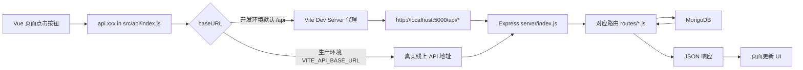

# 网络请求运行说明（Axios + Vue + Express）

这份文档用于解释本项目网络请求是如何运行起来的，按“前端发起 -> 开发代理 -> 后端路由 -> 数据返回”来理解。

## 1. 关键入口

- 前端请求实例：`src/api/index.js`
- 前端开发代理：`vite.config.js`
- 后端入口：`server/index.js`
- 鉴权中间件：`server/middleware/auth.js`

## 2. 一张图看懂请求链路

## 3. Axios 在本项目做了什么

`src/api/index.js` 里有两件最重要的事：

1. 统一了 baseURL
- 默认：`/api`
- 可被环境变量 `VITE_API_BASE_URL` 覆盖

2. 统一了请求拦截器
- 每次请求前读取 `localStorage.getItem("token")`
- 有 token 时自动加请求头：`Authorization: Bearer <token>`

这意味着你在页面写 `api.get("/posts")`，通常不需要重复写完整域名和 token 逻辑。

## 4. 开发环境为什么不需要手写 localhost:5000

`vite.config.js` 配置了代理：

- `/api` -> `http://localhost:5000`

所以浏览器里请求 `/api/posts` 时，实际由 Vite 转发到后端的 `http://localhost:5000/api/posts`。

## 5. 常见接口与前后端对应

### 认证
- 前端登录调用：`POST /login`
- 实际请求地址：`POST /api/login`
- 后端处理：`server/routes/auth.js`
- 结果：返回 JWT token，前端保存到 localStorage

### 文章
- `GET /api/posts`：文章列表（分页）
- `GET /api/posts/:id`：文章详情
- `POST /api/posts`：创建文章（需要 token）
- `PUT /api/posts/:id`：编辑文章（需要 token）
- `DELETE /api/posts/:id`：删除文章（需要 token）
- `POST /api/posts/upload`：上传封面（需要 token）

后端处理文件：`server/routes/posts.js`

### 评论
- `GET /api/comments`：评论列表（后台分页）
- `GET /api/comments/:postId`：文章评论列表
- `POST /api/comments`：发表评论
- `DELETE /api/comments/:id`：删除评论（需要 token）

后端处理文件：`server/routes/comments.js`

## 6. 需要登录与不需要登录的区别

后端通过 `auth` 中间件判断是否有权限。

- 需要登录：删除文章、编辑文章、上传封面、删除评论等
- 不需要登录：查看文章、查看评论、发表评论（当前实现）

如果请求被拒绝，通常会返回 401，常见原因是 token 缺失或过期。

## 7. 一次真实请求示例（删除文章）

1. 管理页点击删除按钮
2. 前端执行 `api.delete("/posts/:id")`
3. Axios 自动带上 Authorization
4. 开发环境由 Vite 代理转发到 Express
5. Express 命中 `server/routes/posts.js` 的删除接口
6. `auth` 中间件先验 token
7. 删除数据库记录并返回结果
8. 前端收到成功响应后刷新列表

## 8. 文件上传请求为什么和普通请求不一样

封面上传走 `FormData + multipart/form-data`，不是普通 JSON。

前端示例逻辑：
- `const form = new FormData()`
- `form.append("cover", file)`
- `api.post("/posts/upload", form, { headers: { "Content-Type": "multipart/form-data" } })`

后端由 `multer` 解析上传文件。

## 9. 你调试请求时可以先看这 4 个点

1. 浏览器 Network 面板：请求 URL、状态码、请求头
2. `src/api/index.js`：baseURL 和 token 是否正确
3. `vite.config.js`：开发代理是否生效
4. 后端控制台：是否命中对应路由、是否有鉴权错误

## 10. 小结

这个项目的核心思路是：

- 用一个 Axios 实例统一请求规则
- 用 Vite 代理解决开发期转发
- 用 Express 路由承接业务
- 用 JWT 中间件保护管理接口

理解这四层后，你以后看任何页面里的 `api.get/post/put/delete` 基本都能快速判断请求最终会走到哪里。

## 11. 继续阅读

- 请求排错速查表（401/404/500）：[REQUEST_TROUBLESHOOTING.md](REQUEST_TROUBLESHOOTING.md)
